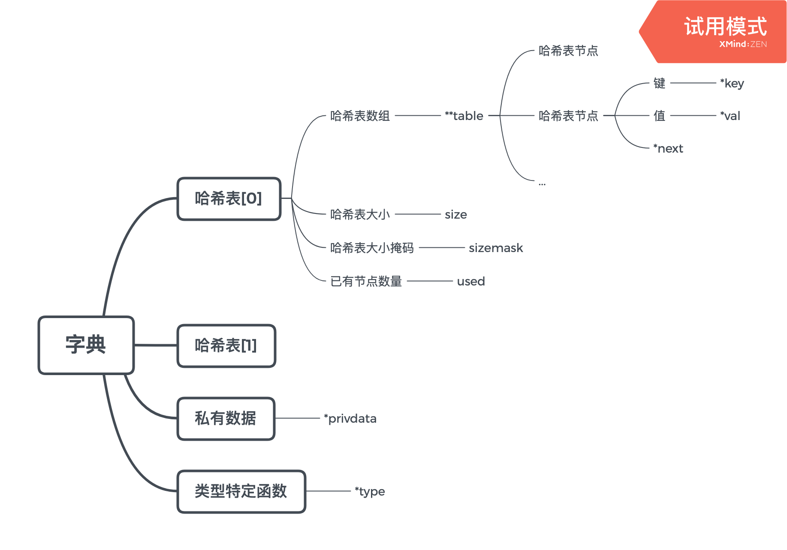

# Dict

index|question
---|---
1|[字典的用途](#用途)
2|[字典的实现](#实现)
3|[哈希算法](#哈希算法)
4|[rehash](#rehash)

### 用途
> 字典又称 符号表(symbol table) 关联数组(associactive array) 映射(map)

类别|用途
---|---
[数据库底层](#数据库底层)|CRUD

##### 数据库底层
> 查找对应键的时候， 所有键值对都是存在字典里的

### 实现
> Redis的字典使用哈希表作为底层实现

### 哈希算法
Q|A
---|---
Redis哈希算法|MurmurHash2算法来计算hash(key)
如何解决键冲突?|链地址法

### rehash
Q|A
---|---
扩展操作, ht[1]的大小?|第一个 >= ht[0].used *2的 `2的n次方幂`
收缩操作, ht[1]的大小?|第一个 >= ht[0].used 的 `2的n次方幂`
执行策略?|直接迁移 & 渐进式rehash 根据`负载因子 = 已有节点/哈希表大小`
